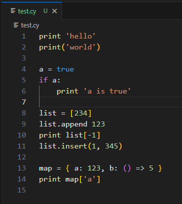

# Cyber 

VSCode support for the [Cyber](https://cyberscript.dev/) Programming Language.

- [Docs](https://fubark.github.io/cyber/)
- [Playground](https://cyberscript.dev/play.html)
- [GitHub](https://github.com/fubark/cyber)

# Features

## Syntax Highlighting

# Roadmap

- finish syntax support
- formatter
- language server

# Supporters

[fubar](https://github.com/fubark) - creator of the Cyber language
